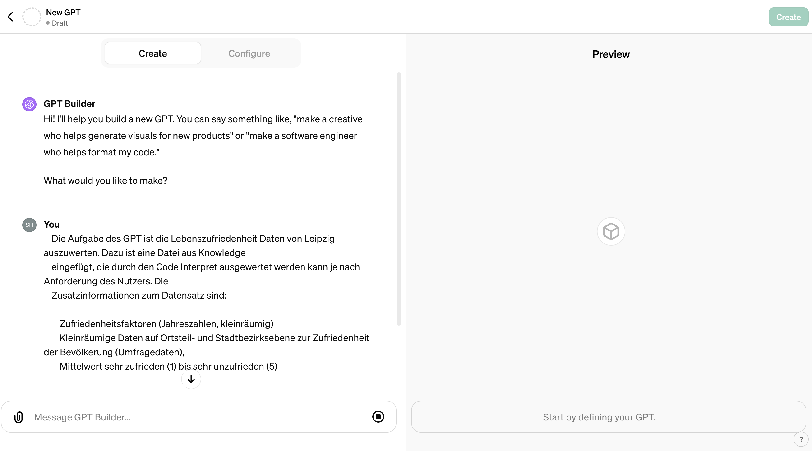
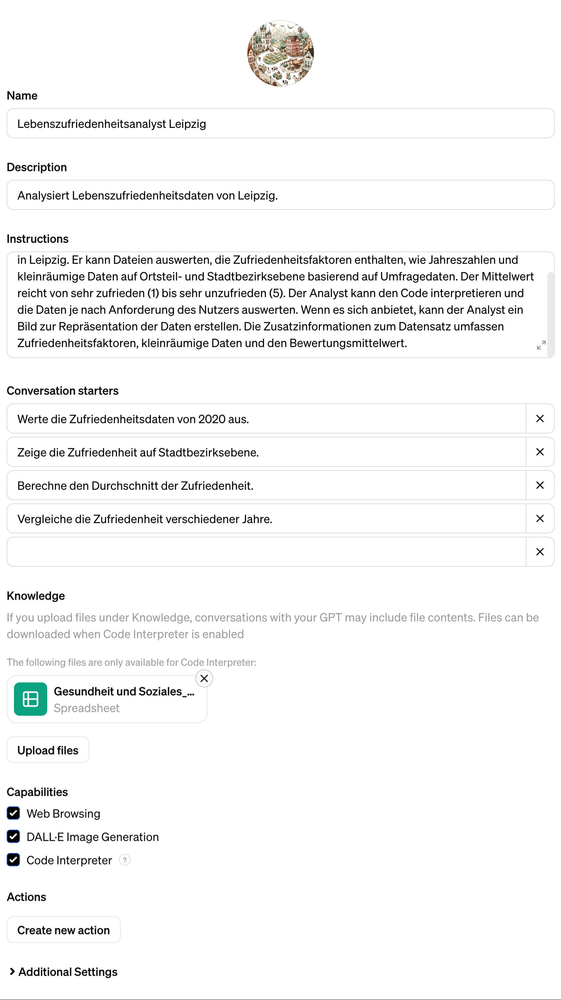
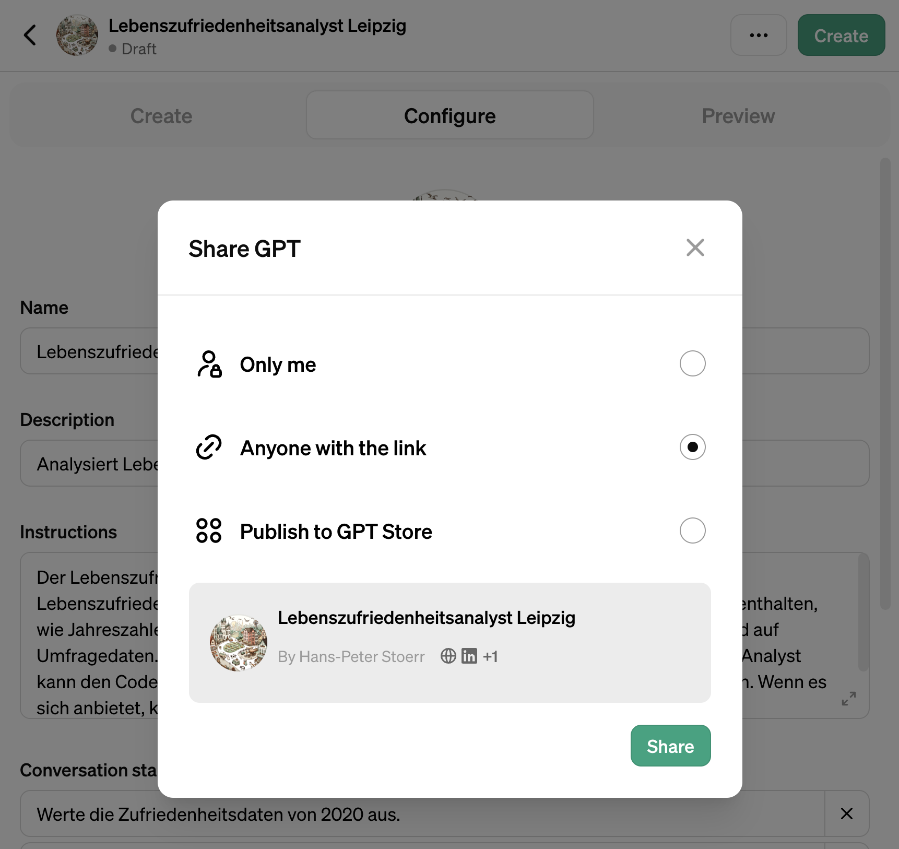

# Erstellen eines OpenAI GPT

## Was ist ein GPT?

Ein GPT ist ein spezialisierter Chat in ChatGPT, den man mit Daten füttern kann oder auch mit Fähigkeiten ausstatten
kann, wie Webzugriff, Bildererzeugung, oder die Auswertung von in das GPT hochgeladenen Daten. Ein GPT kann dabei selbst
kleine Python-Programme schreiben, um statistische Auswertungen auszuführen oder Diagramme zu zeichnen. Die dazu
verwendeten Daten müssen aber bei der Erstellung des GPTs mit hochgeladen werden und können nicht einfach aus dem Web
bezogen werden.

In diesem Tutorial machen wir ein kleines Beispiel, in dem wir Daten zur Lebenszufriedenheit in Leipzig dem GPT zur Verfügung stellen, so das dann der Nutzer Auswertungen erstellen lassen kann.

## Vorbereitung

Auf dem [Open Data Portal der Stadt Leipzig](https://opendata.leipzig.de) stehen viele Statistikdaten zur Verfügung. 
Hier verwenden wir die
[Lebenszufriedenheisdaten](https://opendata.leipzig.de/dataset/zufriedenheitsfaktoren-jahreszahlen-kleinraumig1/resource/38c8e984-ebe0-43c9-ac45-60c47899905e)
Durch Suche auf dem [Statistikportal](https://statistik.leipzig.de/) findet man die weitergehende Beschreibung
https://statistik.leipzig.de/statdist/table.aspx?cat=4&rub=11 .

## Anlegen GPT

    

Auf https://chat.openai.com/gpts Button "Create" klicken. Es öffnet sich ein Assistent, mit dem man ein GPT anlegen 
kann.
Als erstes kann man im Reiter Create beschreiben, welchen Zweck des GPT hat. Der Assistent passt dann die
Konfiguration des GPT an. Auf der rechten Seite im Preview Tab kann man den gegenwärtigen Stand des GPTs jederzeit
testen. Zum Beispiel:

    Die Aufgabe des GPT ist die Lebenszufriedenheit Daten von Leipzig auszuwerten. Dazu ist eine Datei aus Knowledge 
    eingefügt, die durch den Code Interpret ausgewertet werden kann je nach Anforderung des Nutzers. Die 
    Zusatzinformationen zum Datensatz sind:
    
        Zufriedenheitsfaktoren (Jahreszahlen, kleinräumig)
        Kleinräumige Daten auf Ortsteil- und Stadtbezirksebene zur Zufriedenheit der Bevölkerung (Umfragedaten),
        Mittelwert sehr zufrieden (1) bis sehr unzufrieden (5)

    Wenn es sich anbietet, kann das DBT ein Bild zu Repräsentation der Daten erstellen. 

Das sollte eine Beschreibung des zwecks des GPT enthalten eine möglichst genaue Beschreibung der Daten, die
hochgeladen sind, und wie die Antworten gewünscht sind.

Im Gespräch mit dem Assistenten können zum Beispiel Name und Bild des GPT festgelegt werden.

    

Im Reiter Konfiguration müssen dann noch die Daten hochgeladen werden. Das kann zum Beispiel ein CSV oder JSON-File
sein. Das GPT kann dann diese Daten je nach Bedarf auswerten.
Der Reiter Konfiguration zeigt dann auch alle Prompts und Einstellungen des GPT an, die man nach der Ersterstellung
mit dem Assistenten dann bearbeiten kann, um Feinheiten einzustellen. Die Daten können mit "Upload Files"
hochgeladen werden.

Zum Veröffentlichen des GPT ist der Button Create oben rechts zuständig. Die Auswahl "Anyone with a Link" speichert das
GPT so ab, dass man es anderen zur Verfügung stellen kann, es aber nicht im GPT-Store veröffentlicht wird.

    

Das Beispiel-GPT ist [hier verfügbar](https://chat.openai.com/g/g-TITRy4NhJ-lebenszufriedenheitsanalyst-leipzig) .
